# Multi-Agent System Architecture Documentation

This document contains comprehensive UML diagrams that visualize the architecture and behavior of the multi-agent system using Mermaid syntax. All diagrams are embedded directly in this markdown file for easy viewing on GitHub, GitLab, or any Mermaid-compatible platform.

## Diagrams Overview

### 1. Detailed Class Diagram
- **Purpose**: Complete class-level view of all components, interfaces, and relationships
- **Scope**: Shows all classes, traits, enums, and their methods
- **Key Features**:
  - Agent system with `Agent` trait and `RemoteAgent` implementation
  - Protocol abstraction with OpenAI and A2A implementations
  - Team orchestration with different scheduling strategies
  - HTTP server layer with API endpoint handling
  - Configuration system for file-based setup

### 2. High-Level System Architecture
- **Purpose**: Bird's-eye view of system layers and component interactions
- **Scope**: Shows major packages and data flow between them
- **Key Features**:
  - Clear separation of concerns across layers
  - External system dependencies
  - Configuration flow from TOML files
  - Request processing pipeline

### 3. Message Flow Sequence
- **Purpose**: Runtime behavior visualization showing request processing
- **Scope**: Step-by-step message flow from client to AI service
- **Key Features**:
  - Complete request-response cycle
  - Different scheduling strategies (Supervisor vs Workflow)
  - Protocol-specific handling (OpenAI vs A2A)
  - Health check flow

## 1. Detailed Class Diagram

## 2. High-Level System Architecture

```mermaid
graph TB
    %% External Layer
    Client[Client Applications]
    OpenAI_API[OpenAI API Service]
    A2A_Service[Agent-to-Agent Service]
    Config_Files[TOML Config Files]

    %% HTTP API Layer
    subgraph "HTTP API Layer"
        TeamServer[TeamServer]
        OpenAI_Endpoint["/v1/chat/completions<br/>(OpenAI Compatible)"]
        A2A_Endpoint["/v1/chat<br/>(A2A Protocol)"]
        Health_Endpoint["/health"]
    end

    %% Team Orchestration Layer
    subgraph "Team Orchestration Layer"
        Team[Team]
        Router[Router]
        TeamConfig[TeamConfig]
    end

    %% Agent Management Layer
    subgraph "Agent Management Layer"
        AgentManager[AgentManager]
        AgentRegistry[Agent Registry]
        HealthMonitoring[Health Monitoring]
        CapabilityMatching[Capability Matching]
    end

    %% Agent Abstraction Layer
    subgraph "Agent Abstraction Layer"
        AgentTrait[Agent Trait]
        RemoteAgent[RemoteAgent]
    end

    %% Protocol Layer
    subgraph "Protocol Layer"
        ProtocolTrait[Protocol Trait]
        OpenAIProtocol[OpenAIProtocol]
        A2AProtocol[A2AProtocol]
    end

    %% Configuration System
    subgraph "Configuration System"
        ConfigParser[Config Parser]
        AgentConfigs[Agent Configs]
        TeamConfigs[Team Configs]
    end

    %% Data Flow Connections
    Client --> TeamServer
    TeamServer --> OpenAI_Endpoint
    TeamServer --> A2A_Endpoint
    TeamServer --> Health_Endpoint

    TeamServer --> Team
    Team --> SupervisorScheduler
    Team --> WorkflowScheduler
    Team --> TeamConfig

    Team --> AgentManager
    AgentManager --> AgentRegistry
    AgentManager --> HealthMonitoring
    AgentManager --> CapabilityMatching

    AgentManager --> RemoteAgent
    RemoteAgent --> AgentTrait
    RemoteAgent --> OpenAIProtocol
    RemoteAgent --> A2AProtocol

    OpenAIProtocol --> ProtocolTrait
    A2AProtocol --> ProtocolTrait

    OpenAIProtocol --> OpenAI_API
    A2AProtocol --> A2A_Service

    Config_Files --> ConfigParser
    ConfigParser --> AgentConfigs
    ConfigParser --> TeamConfigs
    AgentConfigs --> AgentManager
    TeamConfigs --> Team

    %% Styling
    classDef clientLayer fill:#e1f5fe
    classDef apiLayer fill:#f3e5f5
    classDef orchestrationLayer fill:#e8f5e8
    classDef managementLayer fill:#fff3e0
    classDef abstractionLayer fill:#fce4ec
    classDef protocolLayer fill:#f1f8e9
    classDef configLayer fill:#fff8e1
    classDef externalLayer fill:#f5f5f5

    class Client,OpenAI_API,A2A_Service,Config_Files externalLayer
    class TeamServer,OpenAI_Endpoint,A2A_Endpoint,Health_Endpoint apiLayer
    class Team,SupervisorScheduler,WorkflowScheduler,TeamConfig orchestrationLayer
    class AgentManager,AgentRegistry,HealthMonitoring,CapabilityMatching managementLayer
    class AgentTrait,RemoteAgent abstractionLayer
    class ProtocolTrait,OpenAIProtocol,A2AProtocol protocolLayer
    class ConfigParser,AgentConfigs,TeamConfigs configLayer
```

## 3. Message Flow Sequence

## System Architecture Summary

The multi-agent system is designed with the following key architectural principles:

### 1. **Layered Architecture**
- **HTTP API Layer**: TeamServer provides OpenAI-compatible REST endpoints
- **Team Orchestration**: Team coordinates multiple agents using pluggable schedulers
- **Agent Management**: AgentManager handles registration, discovery, and health monitoring  
- **Agent Abstraction**: Agent trait provides uniform interface to remote AI services
- **Protocol Layer**: Protocol trait abstracts different communication protocols

### 2. **Protocol Abstraction**
- **OpenAI Protocol**: Compatible with OpenAI ChatCompletion API
- **A2A Protocol**: Agent-to-Agent communication protocol with richer metadata
- **Pluggable Design**: Easy to add new protocols by implementing Protocol trait

### 3. **Team Modes**
- **Supervisor Mode**: Single supervisor agent handles all requests
- **Workflow Mode**: Sequential processing through ordered agents
- **Extensible**: New scheduling strategies via Scheduler trait

### 4. **Configuration-Driven**
- **TOML Configuration**: File-based configuration for agents and teams
- **Runtime Flexibility**: Agents and teams can be reconfigured without code changes
- **Metadata Support**: Rich metadata for agent capabilities

### 5. **Error Handling & Observability**
- **Hierarchical Errors**: AgentError wraps ProtocolError with context
- **Health Monitoring**: Built-in health checks for all agents
- **Async/Await**: Full async support for concurrent operations

## Key Components Explained

### Agent System
- `Agent` trait defines the interface for all agents
- `RemoteAgent` implements the trait for HTTP-based AI services
- `AgentManager` provides centralized agent registry and discovery
- `AgentConfig` holds agent metadata, endpoints, and capabilities

### Protocol System  
- `Protocol` trait abstracts communication with AI services
- `OpenAIProtocol` and `A2AProtocol` provide concrete implementations
- Factory function creates appropriate protocol adapters
- Error handling with retry logic and timeouts

### Team System
- `Team` orchestrates multiple agents for complex tasks
- `Scheduler` trait enables different orchestration strategies
- `SupervisorScheduler` for single-agent delegation
- `WorkflowScheduler` for sequential multi-agent processing

### Server System
- `TeamServer` exposes HTTP API endpoints
- OpenAI-compatible `/v1/chat/completions` endpoint
- A2A-specific `/v1/chat` endpoint with richer metadata
- Health monitoring via `/health` endpoint

This architecture enables building complex multi-agent systems that can integrate with various AI services while providing a consistent, scalable interface to clients.

---

**Note**: All diagrams in this document are rendered using Mermaid syntax and will display automatically in:
- GitHub and GitLab repositories
- VS Code with Mermaid extensions
- Documentation platforms like GitBook, Notion, etc.
- Online at [Mermaid Live Editor](https://mermaid.live/)
